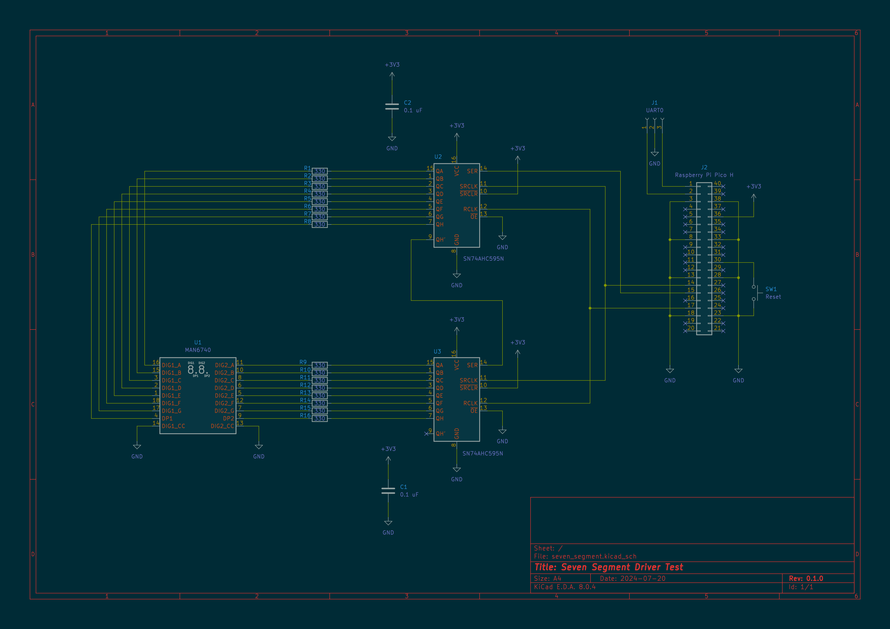

# Hexadecimal Seven Segment Chain Experiment

## Hardware Architecture

Using shift registers, two seven-segment displays are chained so that they can all be updated via a low pin count
interface on the RP2040 (transmit-only SPI 1 port).  Each display digit requires an 8-bit shift register (7 segments and
the decimal point), conveniently fitting each into one byte.  The shift registers are linked in a cascaded manner, with
the first data input tied to the SPI 1 TX pin on the microcontroller and the shift register clock driven by the SPI
clock, with the SPI port configured in mode 0 (CPOL = 0, CPHA = 0).  Finally, shift register storage clock is driven by
the SPI chip select line, latching the latest shifted-in values to the display.

## Firmware Architecture

The pins selected for the interface allow for flexibility in the firmware implementation.  Any of the SPI 1 peripheral,
bit-banged GPIO, or a custom PIO implementation could be used.  The initial experiment uses the dedicated SPI 1
peripheral together with DMA.

The SPI port is initialized for mode 0, with DMA for transmission, and with all receive related errors suppressed.

In this experiment the application passes a byte buffer containing the raw value to be displayed.  Within the display
driver, a lookup table is used to translate the nibbles of each of those bytes to a corresponding single byte bit field
for the display.  Note that the array to be shifted out is big-endian for display purposes, and the farthest display
value in the chain is shifted out first.  Once the bitstream buffer has been constructed, it is passed off to the DMA to
trigger the SPI transmission.

Interpolator 0 is used to calculate the lookup table indices for each nibble of each byte.  This was done primarily to
experiment with the interpolator rather than for any major performance advantage.  The same thing could be achieved in
normal code with a few more cycles and some regular bitwise operations.

## Results

Successfully implemented and demonstrated:

